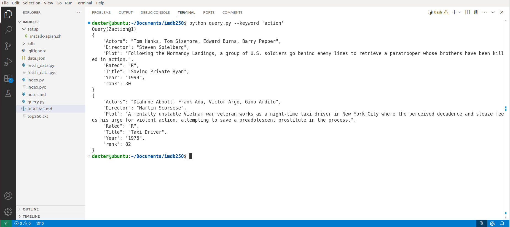
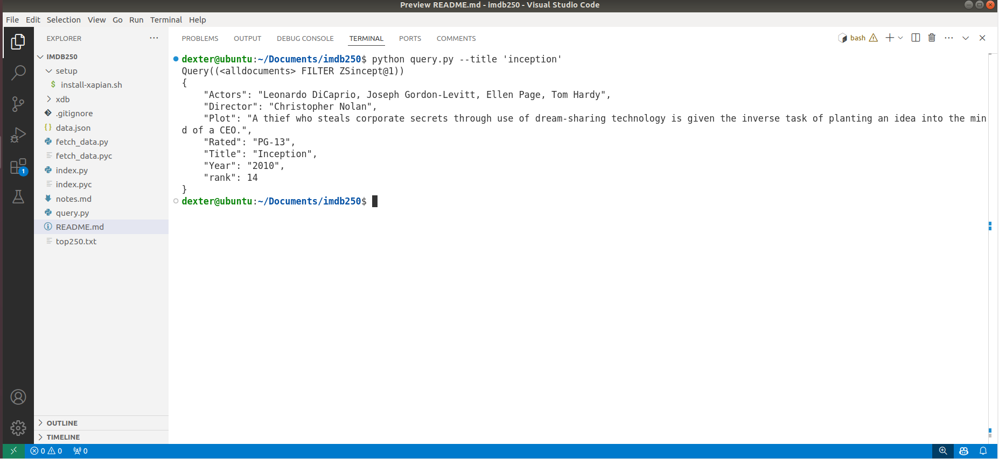
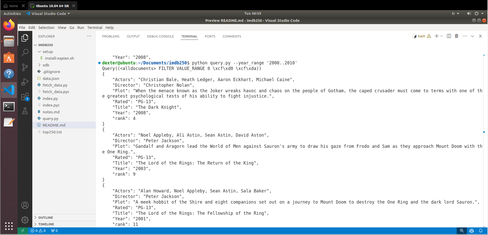
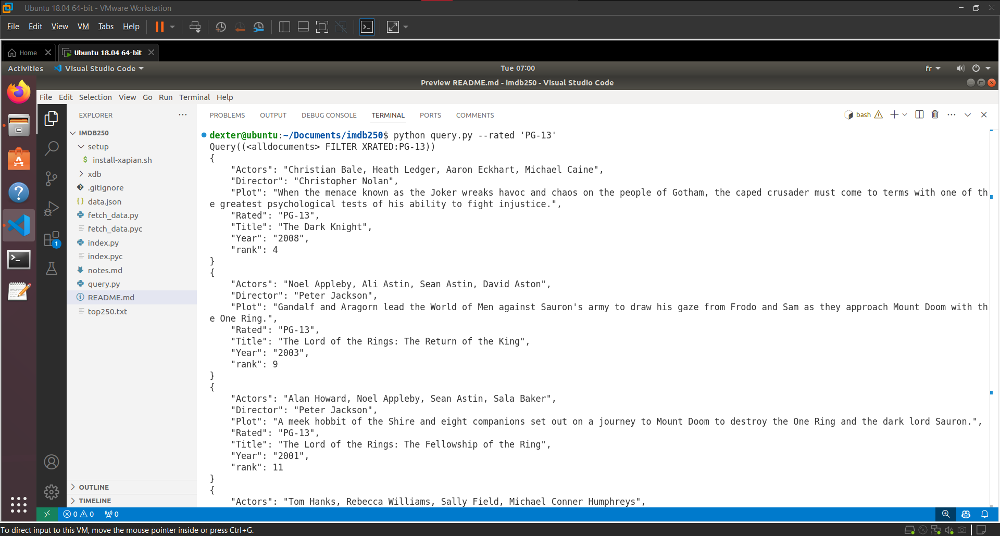
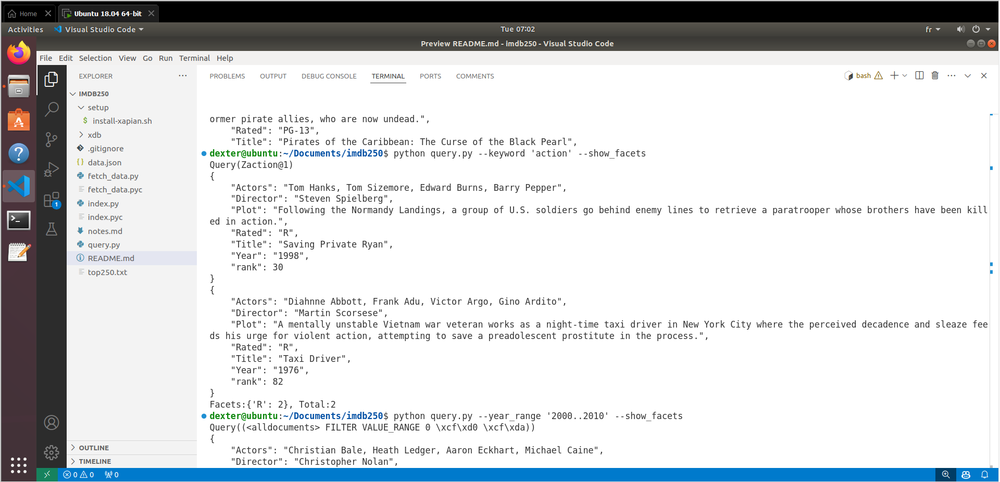
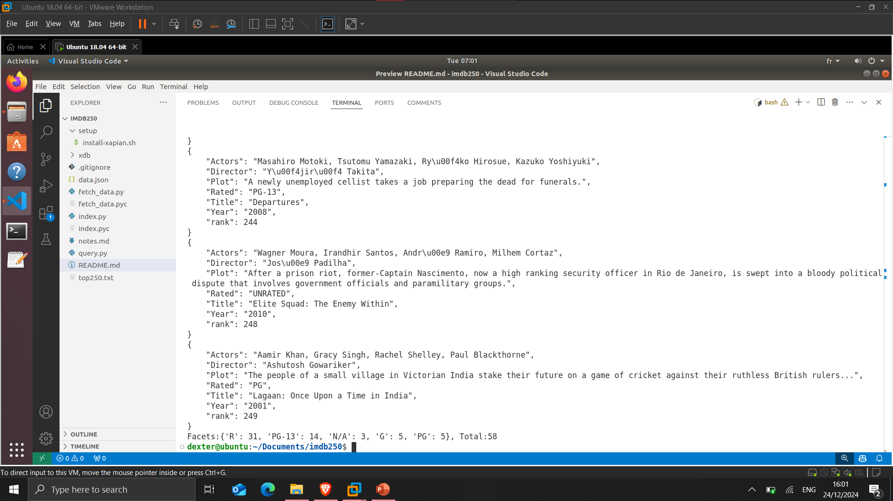

# Guide d'installation et de configuration du projet

## Installation

> Il y a deux éléments de Xapian dont vous avez besoin pour suivre ce guide : la bibliothèque elle-même, et le support pour le langage que vous allez utiliser. Ce guide a été écrit à l'origine avec des exemples en Python, et nous avons commencé à faire des traductions complètes en Java, Perl, PHP et C++. Consultez le [guide](https://getting-started-with-xapian.readthedocs.io/en/latest/overview.html) pour plus d'informations.

### Prérequis

- Ubuntu comme environnement d'exécution
- `Python`, `pip`, `git` installé

Pour installer Python LTS, pip et git sur Ubuntu, exécutez les commandes suivantes dans le terminal :

```sh
sudo apt update
sudo apt install -y python3 python3-pip git
```

### Étapes d'installation

> Dans `Home directory` execute les command suivant

1. **Cloner le projet**

   Clonez le dépôt du projet sur votre machine local:

   ```sh
   git clone https://github.com/Abdelhakim-gh/SRI_Project
   cd SRI_Project
   ```

2. **Installer Xapian**

   Exécutez le script `setup/install-xapian.sh` pour télécharger et configurer l'environnement Xapian & dependence ou suivez les instructions dans le fichier :

   ```sh
   cp setup/install-xapian.sh ~/
   cd
   sh install-xapian.sh
   ```

## Indexer la base de données Xapian

1. **Récupérer les données**

   Exécutez le script `fetch_data.py` pour récupérer les données des films depuis l'API OMDB :

   ```sh
   python fetch_data.py
   ```

2. **Indexer les données**

   Exécutez le script `index.py` pour indexer les données des films récupérées dans une base de données Xapian :

   ```sh
   python index.py
   ```

## Interroger le moteur de recherche

Utilisez le script `query.py` avec différentes options pour interroger les données indexées. Voici quelques exemples :

- Rechercher des films par mot-clé dans le résumé ou la description :

  ```sh
  python query.py --keyword 'action'
  ```

- Rechercher des films avec un titre spécifique :

  ```sh
  python query.py --title 'inception'
  ```

- Rechercher des films dans une plage d'années spécifique :

  ```sh
  python query.py --year_range '2000..2010'
  ```

- Rechercher des films avec une classification spécifique :

  ```sh
  python query.py --rated 'PG-13'
  ```

- Afficher les facettes sur les résultats (par exemple, le nombre de films par classification) :

  ```sh
  python query.py --keyword 'action' --show_facets
  ```

## Demo

Voici quelques images de démonstration :








## Conclusion

Ce projet démontre les bases de la création d'un système de recherche d'informations en utilisant Xapian. En suivant les étapes fournies, vous pouvez :

1. Récupérer, indexer et interroger des données depuis une API externe.
2. Implémenter un système de recherche évolutif et personnalisable.
3. Étendre le système avec des fonctionnalités avancées telles que la recherche facettée, les requêtes par plage et les opérateurs booléens.
